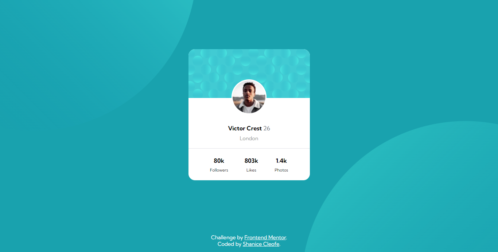
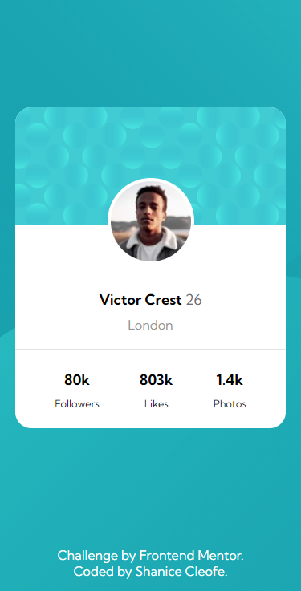

# Frontend Mentor - Profile card component solution

This is a solution to the [Profile card component challenge on Frontend Mentor](https://www.frontendmentor.io/challenges/profile-card-component-cfArpWshJ). Frontend Mentor challenges help you improve your coding skills by building realistic projects.

## Table of contents

- [Overview](#overview)
  - [The challenge](#the-challenge)
  - [Screenshot](#screenshot)
  - [Links](#links)
- [My process](#my-process)
  - [Built with](#built-with)
  - [What I learned](#what-i-learned)
  - [Useful resources](#useful-resources)
- [Author](#author)

## Overview

### The challenge

- Build out the project to the designs provided

### Screenshot

## Desktop Preview



## Mobile Preview



### Links

- Solution URL: [Frontend Mentor Solution](https://www.frontendmentor.io/solutions/profile-card-component-PEgqKOMHrA)
- Live Site URL: [Profile Card Layout](https://sdacleofe.github.io/profile-card-component-main/)

## My process

### Built with

- Semantic HTML5 markup
- FlexBox
- Sass

### What I learned

The user profile photo and the background was the most challenging part of building this project. Even so, I solved it with CSS position and FlexBox.

```html
<h1>Some HTML code I'm proud of</h1>
```

```scss
.card-cover-photo {
  display: flex;
  justify-content: center;
  align-items: end;
  position: relative;
  background-image: url('/images/bg-pattern-card.svg');
  background-repeat: no-repeat;
  background-size: cover;
  height: 150px;
  width: 100%;

  .image {
    position: absolute;
    bottom: -50px;
    background-image: url('/images/image-victor.jpg');
    background-repeat: no-repeat;
    background-size: contain;
    width: 100px;
    height: 100px;
    border-radius: 100%;
    border: 4px solid;
    border-color: $white;
  }
}
```

### Useful resources

- [ChatGPT](https://www.example.com) - This helped me for finding answers to my questions. I really liked this pattern and will use it going forward.

## Author

- Website - [Shanice](https://github.com/sdacleofe/about-me)
- Frontend Mentor - [@sdacleofe](https://www.frontendmentor.io/profile/sdacleofe)
